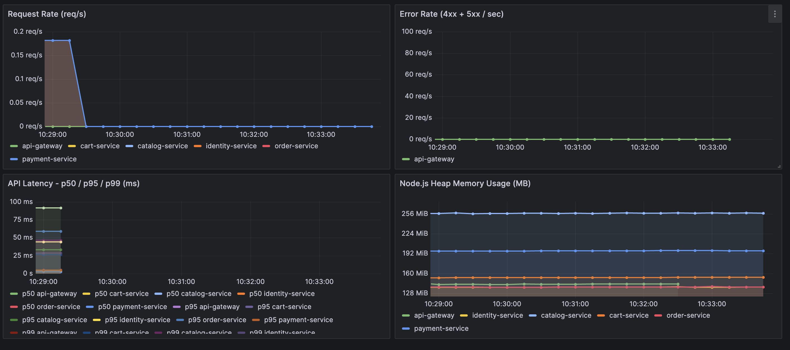

# Project Aura

A scalable E-Commerce platform built with a Microservices architecture, using Node.js, TypeScript, and Docker.

## Architecture

```
Client (React/Mobile)
        |
  API Gateway (Express - Port 3000)
        |
  ┌─────┼──────────┬──────────┬──────────┐
  |     |          |          |          |
Identity  Catalog    Cart     Order    Payment
:3001    :3002     :3003    :3004     :3005
  |       |          |        |          |
Postgres  MongoDB   Redis   Postgres  Postgres + Stripe
```

## Tech Stack

| Layer | Technology |
|-------|-----------|
| Runtime | Node.js + TypeScript |
| API Gateway | Express + http-proxy-middleware + helmet + rate limiting |
| Identity Service | Express + PostgreSQL (`pg`) + JWT + bcrypt |
| Catalog Service | Express + MongoDB (`mongoose`) |
| Cart Service | Express + Redis (`ioredis`) |
| Order Service | Express + PostgreSQL (`pg`) + Axios |
| Payment Service | Express + PostgreSQL (`pg`) + Stripe SDK |
| API Docs | Swagger UI (swagger-jsdoc) |
| Observability | Prometheus + Grafana (prom-client) |
| Testing | Jest + ts-jest + Supertest |
| CI/CD | GitHub Actions |
| Infrastructure | Docker Compose |

## Getting Started

### Prerequisites

- Node.js v20+
- Docker & Docker Compose
- Git

### Installation

```bash
git clone https://github.com/Jimrealf/project-aura.git
cd project-aura
npm install
```

### Start Infrastructure

```bash
docker compose up -d
```

This spins up PostgreSQL, MongoDB, and Redis containers.

### Configure Environment

Each service requires a `.env` file. Copy the example files and fill in your values:

```bash
cp services/identity-service/.env.example services/identity-service/.env
cp services/catalog-service/.env.example services/catalog-service/.env
cp services/cart-service/.env.example services/cart-service/.env
cp services/order-service/.env.example services/order-service/.env
cp services/payment-service/.env.example services/payment-service/.env
```

> **Note:** The Catalog Service requires Cloudinary credentials for image uploads. The Payment Service requires Stripe test keys (see [Stripe Local Development](#stripe-local-development) below).

### Run Services

```bash
npm run dev:gateway    # API Gateway       → http://localhost:3000
npm run dev:identity   # Identity Service  → http://localhost:3001
npm run dev:catalog    # Catalog Service   → http://localhost:3002
npm run dev:cart       # Cart Service      → http://localhost:3003
npm run dev:order      # Order Service     → http://localhost:3004
npm run dev:payment    # Payment Service   → http://localhost:3005
```

### API Documentation

With the gateway running, visit: **http://localhost:3000/api-docs**

### Run Tests

```bash
npm test
```

### Stop Infrastructure

```bash
docker compose down
```

## Project Structure

```
project-aura/
├── api-gateway/             # Express reverse proxy & Swagger UI
├── packages/
│   ├── auth-middleware/     # Shared JWT verification (@aura/auth-middleware)
│   └── metrics/             # Shared Prometheus metrics (@aura/metrics)
├── services/
│   ├── identity-service/    # Auth & Users (PostgreSQL)
│   ├── catalog-service/     # Products & Inventory (MongoDB)
│   ├── cart-service/        # Shopping Cart (Redis)
│   ├── order-service/       # Checkout & Orders (PostgreSQL)
│   └── payment-service/     # Payments & Stripe (PostgreSQL + Stripe)
├── observability/            # Prometheus + Grafana stack
├── .github/workflows/       # CI pipeline (GitHub Actions)
├── docker-compose.yml       # Local infrastructure
├── tsconfig.json            # Shared TypeScript config
└── jest.config.ts           # Test configuration
```

Each microservice follows a layered architecture: `controllers/ → services/ → repositories/`

## API Endpoints

### Identity Service (Port 3001)

| Method | Route | Access | Description |
|--------|-------|--------|-------------|
| POST | `/api/auth/register` | Public | Customer registration |
| POST | `/api/auth/register/vendor` | Public | Vendor registration |
| POST | `/api/auth/login` | Public | Login (returns JWT) |
| POST | `/api/auth/internal-user` | Admin only | Create support/admin users |
| POST | `/api/auth/forgot-password` | Public | Request password reset token |
| POST | `/api/auth/reset-password` | Public | Reset password with token |

### Catalog Service (Port 3002)

| Method | Route | Access | Description |
|--------|-------|--------|-------------|
| GET | `/api/products` | Public | List products (pagination, filters, search by `?q=...`) |
| GET | `/api/products/:slug` | Public | View single product |
| POST | `/api/products` | Admin/Vendor | Create product (supports `multipart/form-data` image upload) |
| PUT | `/api/products/:id` | Admin/Vendor | Update product details or images |
| DELETE | `/api/products/:id` | Admin/Vendor | Soft-delete a product |

### Cart Service (Port 3003)

| Method | Route | Access | Description |
|--------|-------|--------|-------------|
| POST | `/api/cart` | Authenticated | Add item to cart (`{ slug, quantity }`) |
| GET | `/api/cart` | Authenticated | View current cart with subtotal |
| PUT | `/api/cart` | Authenticated | Update item quantity (`{ product_id, quantity }`) |
| DELETE | `/api/cart/:productId` | Authenticated | Remove specific item from cart |
| DELETE | `/api/cart` | Authenticated | Clear entire cart |

### Order Service (Port 3004)

| Method | Route | Access | Description |
|--------|-------|--------|-------------|
| POST | `/api/checkout` | Customer | Place an order from current cart |
| GET | `/api/orders/me` | Authenticated | View my order history (paginated) |
| GET | `/api/orders/me/:orderId` | Authenticated | View a specific order's details |
| GET | `/api/orders` | Admin only | View all orders (paginated, filterable by status) |
| PATCH | `/api/orders/:orderId/status` | Admin only | Update order status |

### Payment Service (Port 3005)

| Method | Route | Access | Description |
|--------|-------|--------|-------------|
| POST | `/api/payments/intent` | Customer | Create a Stripe PaymentIntent for an order |
| POST | `/api/payments/webhook` | Public (Stripe signature) | Receive Stripe webhook events |
| GET | `/api/payments/order/:orderId` | Authenticated | Get payment status for an order |
| GET | `/api/payments` | Admin only | List all payments (paginated, filterable) |

### Stripe Local Development

The Payment Service requires Stripe test keys. Copy the `.env.example` file:

```bash
cp services/payment-service/.env.example services/payment-service/.env
# Edit .env with your Stripe test keys
```

To receive webhooks locally, use the [Stripe CLI](https://stripe.com/docs/stripe-cli):

```bash
stripe listen --forward-to localhost:3005/api/payments/webhook
```

Use Stripe test card `4242 4242 4242 4242` for successful payments.

## Security

- **Rate Limiting** — Per-IP rate limiting at the API Gateway with stricter limits on sensitive endpoints
- **Security Headers** — `helmet` middleware hardens all responses
- **CORS** — Configurable via `ALLOWED_ORIGINS` env var (comma-separated), defaults to `*` in dev
- **Error Handling** — Global error handler in every service ensures no stack traces are leaked; all errors return clean JSON

## Observability

Every service exposes a `/metrics` endpoint in Prometheus format, tracking request rates, latency percentiles, error rates, and Node.js memory usage.

### Start the Monitoring Stack

```bash
cd observability
docker compose up -d
```

- **Prometheus** — http://localhost:9090 (scrapes all 6 services every 5s)
- **Grafana** — http://localhost:3100 (login: `admin` / `admin`)

Grafana auto-provisions a **Project Aura - Microservices Overview** dashboard with four panels:



### Stop Monitoring

```bash
cd observability
docker compose down
```

## Continuous Integration

Every push to `main` and every pull request triggers a GitHub Actions pipeline that:

1. Spins up PostgreSQL, MongoDB, and Redis containers
2. Installs dependencies
3. Runs the full 162+ test suite

The workflow is defined in `.github/workflows/ci.yml`.

## Seed Data

Populate the databases with test users, sample products, and realistic orders:

```bash
docker compose up -d
npm run seed:identity
npm run seed:catalog
npm run seed:orders
```

> **Note:** Seeds must be run in order. `seed:orders` depends on users from `seed:identity` and products from `seed:catalog`.

The order seed creates 1-4 orders per customer (50-100 total orders) with randomized products, quantities, shipping addresses, statuses, and dates spanning the last 90 days.

### Test Accounts

Test accounts are automatically generated during the seed process. Please refer to the comments at the top of `services/identity-service/src/utils/seed.ts` for the default login credentials.

## License

ISC
